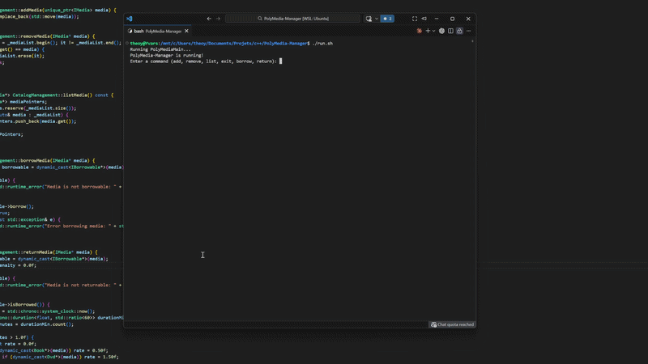

# PolyMedia-Manager


## PolyMedia - Gestionnaire de Bibliothèque

PolyMedia est une application console en C++ qui permet de gérer un catalogue de médias variés. L'objectif est de simuler le fonctionnement d'une bibliothèque où chaque objet a ses propres règles.

## Le système est découpé en plusieurs commandes simples :



**add** : Ajouter un nouveau média au catalogue (Livre, DVD ou Magazine).

**remove** : Supprimer un média existant par son titre.

**list** : Afficher l'intégralité du catalogue, les prix, les genres et le statut de disponibilité.

**borrow** : Emprunter un média. Le système enregistre l'heure précise de l'emprunt.

**return** : Rendre un média.

 - Note : Si le média est rendu en retard (simulé ici à > 1 minute), une pénalité financière est calculée et affichée.

**exit** : Fermer l'application proprement.

## Installation & Compilation

### Compiler le projet :

```bash
chmod +x build.sh
./build.sh
```
Ceci génère l'exécutable dans le dossier /build.

### Nettoyer les fichiers de build :

```bash
./clean.sh
```
### Exécution

Pour lancer l'application principale :

```bash
./run.sh
```
Ou manuellement : ./build/PolyMediaMain

### Tests & Qualité

```bash
./testWithCoverage.sh
```

Ce script génère un rapport montrant quelles lignes de code sont réellement testées. -> index.html

